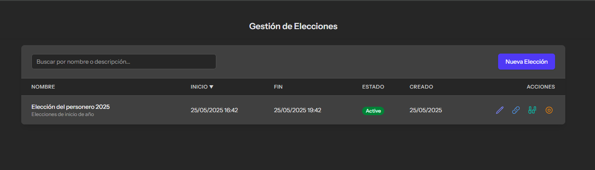

# Sistema de Votación Estudiantil (Versión 0.1)

Este proyecto es un sistema de votación diseñado para facilitar las elecciones estudiantiles (por ejemplo, para personero) en instituciones educativas. Está construido con Laravel 12, Livewire y Tailwind CSS.

## Características Principales (Versión 0.1)

* **Gestión de Estudiantes:**
    * Listado, creación, edición de estudiantes.
    * Búsqueda y ordenamiento en el listado.
    * Activación/Desactivación de estudiantes.
    * Interfaz para importación de estudiantes desde archivos Excel (plantilla descargable, subida de archivo, y simulación de procesamiento por chunks en la interfaz modal).

    

    

* **Gestión de Elecciones:**
    * Listado, creación y edición de elecciones.
    * Definición de nombre, descripción, fechas de inicio/fin y estado (Programada, Activa, Completada, Archivada).
    * Búsqueda y ordenamiento en el listado.
    * Opción para que el administrador finalice manualmente una elección activa.

    
    

* **Gestión de Candidatos:**
    * Listado, creación, edición y eliminación de candidaturas.
    * Vinculación de un estudiante existente a una elección específica.
    * Campos para propuesta, número en tarjetón y subida de foto para el candidato.
    * Búsqueda y ordenamiento en el listado (incluyendo por nombre de estudiante y elección).

    

* **Proceso de Votación para Estudiantes:**
    * Generación de un enlace/token único por parte del administrador para iniciar una sesión de votación en un "quiosco" o estación de votación.
    * Pantalla de identificación de votante (ingreso de identificador estudiantil) asociada a una elección específica.
    * Validación de elegibilidad del estudiante (activo, no ha votado en esa elección).
    * Tarjetón electoral digital que muestra los candidatos de la elección activa y la opción de "Voto en Blanco".
    * Confirmación de voto.
    * Registro anónimo del voto y marcación de participación del estudiante.
    * Página de agradecimiento con redirección automática a la pantalla de identificación para el siguiente votante.

    

    

* **Configuraciones Generales:**
    * Panel para ajustar configuraciones globales del sistema de votación:
        * Intervalo de actualización para la vista de resultados parciales.
        * Umbral mínimo de votos antes de mostrar/actualizar resultados.
    
* **Visualización de Resultados (Básica):**
    * Página para ver los resultados de una elección (actualización por polling).
    * Muestra votos por candidato y votos en blanco, con porcentajes.
    * Aplica el umbral mínimo de votos para mostrar resultados.
    * Si la elección está completada, destaca al ganador(es) con su foto en grande y resultados, mostrando a los demás participantes de forma más resumida.

    
 
    

* **Interfaz de Administración:**
    * Dashboard básico con estadísticas generales.
    * Navegación clara entre los diferentes módulos.
    * Diseño responsivo con Tailwind CSS y modo oscuro.

    
---
## Requisitos Técnicos

* PHP (versión recomendada por Laravel 12, ej. 8.2+)
* Composer
* Node.js & npm (o yarn)
* Servidor Web (Nginx o Apache)
* Base de Datos (MySQL por defecto en este proyecto)
* Laravel 12
* Livewire 3
* Tailwind CSS
* Maatwebsite/Excel (para importación/exportación de plantillas)

---
## Instalación (Guía Básica)

1.  **Clonar el repositorio:**
    ```bash
    git clone [https://github.com/jjarroyo/sistema-votacion-estudiantil-laravel.git](https://github.com/jjarroyo/sistema-votacion-estudiantil-laravel.git) 
    cd tu-repositorio
    ```
2.  **Instalar dependencias de PHP:**
    ```bash
    composer install
    ```
3.  **Instalar dependencias de Node.js:**
    ```bash
    npm install
    # o
    yarn install
    ```
4.  **Crear archivo `.env`:**
    Copia `.env.example` a `.env` y configura tus variables de entorno (base de datos, URL de la aplicación, etc.).
    ```bash
    cp .env.example .env
    php artisan key:generate
    ```
5.  **Configurar la Base de Datos:**
    Asegúrate de que tu base de datos esté creada y las credenciales en `.env` sean correctas.
6.  **Ejecutar Migraciones y Seeders:**
    ```bash
    php artisan migrate --seed 
    # (Asegúrate de tener tus seeders listos, especialmente el AdminUserSeeder)
    ```
7.  **Compilar assets:**
    ```bash
    npm run dev
    # o para producción: npm run build
    ```
8.  **Crear el enlace simbólico para el almacenamiento público:**
    (Necesario para ver las fotos de los candidatos y otros archivos públicos)
    ```bash
    php artisan storage:link
    ```
9.  **Servir la aplicación:**
    ```bash
    php artisan serve
    ```
    O configúrala con tu servidor web local (Laragon, XAMPP, Valet, etc.).

---
## Módulos y Funcionalidades Clave

### 1. Panel de Administración

* **Gestión de Estudiantes:**
    * Listado con búsqueda y ordenamiento.
        * Formulario de Creación/Edición.
        * Modal de Importación Excel (con descarga de plantilla).
        * **Gestión de Elecciones:**
    * Listado con búsqueda y ordenamiento.
        * Opción para "Generar Enlace de Votación" y "Finalizar Elección".
    * Formulario de Creación/Edición (Nombre, Fechas, Estado).
        * **Gestión de Candidatos:**
    * Listado con filtros.
        * Formulario de Creación/Edición (Seleccionar Elección, Estudiante, Propuesta, Foto, Número).
        * **Configuraciones:**
    * Ajustes para la visualización de resultados.
        * **Resultados de Elecciones:**
    * Vista de resultados con actualización periódica.
        * Vista de resultados finales con ganador destacado.
        ### 2. Interfaz de Votación para Estudiantes

* **Pantalla de Identificación:**
    * Acceso mediante token/enlace único.
    * Título de la elección.
    * Campo para identificador estudiantil.
        * **Tarjetón Electoral:**
    * Muestra de candidatos y "Voto en Blanco".
    * Modal de confirmación de voto.
        * **Página de Agradecimiento:**
    * Mensaje de voto registrado y redirección.
        ---
## Próximos Pasos (Desarrollo Futuro - v0.2+)

* Implementación completa del procesamiento de Excel
* Mejoras en la UI/UX del tarjetón y la selección de estudiantes (ej. buscador para estudiantes al crear candidato).
* Teclado numérico en pantalla para la identificación del votante.
* Gráficas para la visualización de resultados.
* Roles y permisos más granulares si se necesitan múltiples tipos de administradores.
* Auditoría de votos y procesos.
* Pruebas unitarias y de integración más exhaustivas.
* Optimización de rendimiento para grandes volúmenes de datos.

---
## Contribuciones

Las contribuciones son bienvenidas. Por favor, abre un issue primero para discutir lo que te gustaría cambiar o añadir.

---
## Licencia

Este proyecto está bajo la Licencia MIT. Ver el archivo `LICENSE` para más detalles.